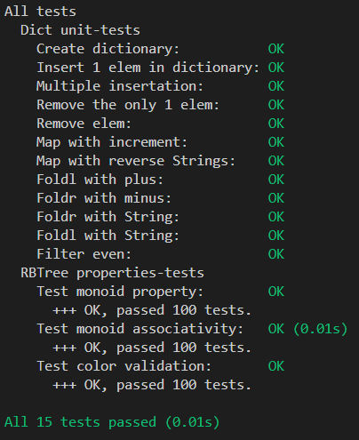

# Лабораторная работа №2

Хасаншин Марат Айратович P3333  
Структура данных: RedBlack Tree
Интерфейс: Dict

## Требования к разработанному ПО

1. Функции:
    - добавление и удаление элементов
    - фильтрация
    - отобрадение (map)
    - свертски (левая и правая)
    - структура должна быть моноидом
2. Структура данных должна быть неизменяемой
3. Библиотека должна быть протестирована в рамках unit-testing
4. Библиотека должна быть протестирована в рамках property-based тестирования (как минимум 3 свойства, включая свойства моноида)
5. Структура данных должна быть полиморфной
6. Требуется использовать идиоматичный для технологии стиль программирования

## Реализация структуры данных

Структура данных RedBlack Tree реализована в [RBTree](src/RBTree.hs)  
Основано на Okasaki|(Functional Data Structures)

Интерфейс Dict реализован в [Dict](src/Dict.hs)

### Типы

```Haskell
data Color = Red | Black deriving (Show, Eq)

data RBDictionary a b
  = Leaf
  | Node
      { key :: a,
        value :: b,
        color :: Color,
        leftChild ::
          RBDictionary
            a
            b,
        rightChild ::
          RBDictionary
            a
            b
      }
  deriving (Show)
```

### Вставка

Происходит поиск нужного места и на него вставляется красный Node. Далее происходит балансировка, проверяющая и исправляющая Red-Red случаи.
При попытке вставить элемент с уже существующим ключом, у него меняется значение.

```Haskell
insert' :: (Ord a) => a -> b -> RBDictionary a b -> RBDictionary a b
insert' k v d = makeBlack $ insertHelper k v d

insertHelper :: (Ord a) => a -> b -> RBDictionary a b -> RBDictionary a b
insertHelper k v Leaf = Node k v Red Leaf Leaf
insertHelper k v node@Node {key = nk, leftChild = left, rightChild = right}
  | k < nk = balance (node {leftChild = insertHelper k v left})
  | k > nk = balance (node {rightChild = insertHelper k v right})
  | otherwise = node {value = v}

balance :: RBDictionary a b -> RBDictionary a b
balance (Node z zv Black (Node y yv Red (Node x xv Red a b) c) d) = Node y yv Red (Node x xv Black a b) (Node z zv Black c d)
balance (Node z zv Black (Node x xv Red a (Node y yv Red b c)) d) = Node y yv Red (Node x xv Black a b) (Node z zv Black c d)
balance (Node x xv Black a (Node z zv Red (Node y yv Red b c) d)) = Node y yv Red (Node x xv Black a b) (Node z zv Black c d)
balance (Node x xv Black a (Node y yv Red b (Node z zv Red c d))) = Node y yv Red (Node x xv Black a b) (Node z zv Black c d)
balance n = n
```

### Удаление

При удалении элемента из красно-черного дерева сначала находят и удаляют узел, после чего сливают его левое и правое поддеревья (если необходимо). Затем балансируют дерево, выполняя соответствующие операции balL и balR.

```Haskell
remove' :: (Ord a) => a -> RBDictionary a b -> RBDictionary a b
remove' k dict = makeBlack $ del k dict

del :: (Ord a) => a -> RBDictionary a b -> RBDictionary a b
del _ Leaf = Leaf
del k node@Node {key = nk, leftChild = left, rightChild = right}
  | k < nk = delL k node
  | k > nk = delR k node
  | otherwise = fuse left right

balL :: RBDictionary a b -> RBDictionary a b
balL (Node y yv Black (Node x xv Red t1 t2) t3) = Node y yv Red (Node x xv Black t1 t2) t3
balL (Node y yv Black t1 (Node z zv Black t2 t3)) = balance' (Node y yv Black t1 (Node z zv Red t2 t3))
balL (Node y yv Black t1 (Node z zv Red (Node u uv Black t2 t3) (Node t tval Black l r))) = Node u uv Red (Node y yv Black t1 t2) (balance' (Node z zv Black t3 (Node t tval Red l r)))
balL node = node

balR :: RBDictionary a b -> RBDictionary a b
balR (Node y yv Black t1 (Node x xv Red t2 t3)) = Node y yv Red t1 (Node x xv Black t2 t3)
balR (Node y yv Black (Node z zv Black t1 t2) t3) = balance' (Node y yv Black (Node z zv Red t1 t2) t3)
balR (Node y yv Black (Node z zv Red (Node t tv Black l r) (Node u uv Black t2 t3)) t4) = Node u uv Red (balance' (Node z zv Black (Node t tv Red l r) t2)) (Node y yv Black t3 t4)
balR node = node

delL :: (Ord a) => a -> RBDictionary a b -> RBDictionary a b
delL k (Node y yv _ t1@(Node _ _ Black _ _) t2) = balL $ Node y yv Black (del k t1) t2
delL k (Node y yv _ t1 t2) = Node y yv Red (del k t1) t2
delL _ Leaf = Leaf

delR :: (Ord a) => a -> RBDictionary a b -> RBDictionary a b
delR k (Node y yv _ t1 t2@(Node _ _ Black _ _)) = balR $ Node y yv Black t1 (del k t2)
delR k (Node y yv _ t1 t2) = Node y yv Red t1 (del k t2)
delR _ Leaf = Leaf

fuse :: RBDictionary a b -> RBDictionary a b -> RBDictionary a b
fuse Leaf t = t
fuse t Leaf = t
fuse t1@(Node _ _ Black _ _) (Node y yv Red t3 t4) = Node y yv Red (fuse t1 t3) t4
fuse (Node x xv Red t1 t2) t3@(Node _ _ Black _ _) = Node x xv Red t1 (fuse t2 t3)
fuse (Node x xv Red t1 t2) (Node y yv Red t3 t4) =
  let s = fuse t2 t3
   in case s of
        (Node z zv Red s1 s2) -> Node z zv Red (Node x xv Red t1 s1) (Node y yv Red s2 t4)
        (Node _ _ Black _ _) -> Node x xv Red t1 (Node y yv Red s t4)
        Leaf -> Node x xv Red t1 (Node y yv Red Leaf t4)
fuse (Node x xv Black t1 t2) (Node y yv Black t3 t4) =
  let s = fuse t2 t3
   in case s of
        (Node z zv Red s1 s2) -> Node z zv Red (Node x xv Black t1 s1) (Node y yv Black s2 t4)
        (Node _ _ Black _ _) -> balL (Node x xv Black t1 (Node y yv Black s t4))
        Leaf -> balL (Node x xv Black t1 (Node y yv Red Leaf t4))
```

### Дополнительные операции

Реализованы дополнительные операции над словарём: foldr'', foldl'', map', filter'.

```Haskell
map' :: (Ord a) => (b -> c) -> RBDictionary a b -> RBDictionary a c
map' _ Leaf = Leaf
map' f node@Node {value = vl, leftChild = left, rightChild = right} = node {value = f vl, leftChild = map' f left, rightChild = map' f right}

foldl'' :: (Ord a) => ((a, b) -> c -> c) -> c -> RBDictionary a b -> c
foldl'' _ acc Leaf = acc
foldl'' f acc (Node {key = k, value = vl, leftChild = left, rightChild = right}) = foldl'' f (f (k, vl) (foldl'' f acc left)) right

foldr'' :: (Ord a) => ((a, b) -> c -> c) -> c -> RBDictionary a b -> c
foldr'' _ acc Leaf = acc
foldr'' f acc (Node {key = k, value = vl, leftChild = left, rightChild = right}) = foldr'' f (f (k, vl) (foldr'' f acc right)) left

filter' :: (Ord a) => (b -> Bool) -> RBDictionary a b -> RBDictionary a b
filter' p = foldr'' (\(k, vl) d -> if p vl then insert' k vl d else d) (fromList' [])
```

## Тестирование

### Тесты для интерфейса

Тесты написаны с помощью HUnit. Реализованы в [TestDict](test/TestDict.hs)
Проверяется создание, вставка, удаление, map, foldl, foldr, filter

### Тесты структуры данных

Проводится property-based testing при помощи QuickCheck.
Реализованы в [PropertyTestRBTree](test/PropertyTestRBTree.hs)

Проверяются:

1. Свойства Моноида (нейтральный элемент, ассоциативность)
2. Свойства красно-черного дерева (корректность раскраски)

### Отчет по тестированию


